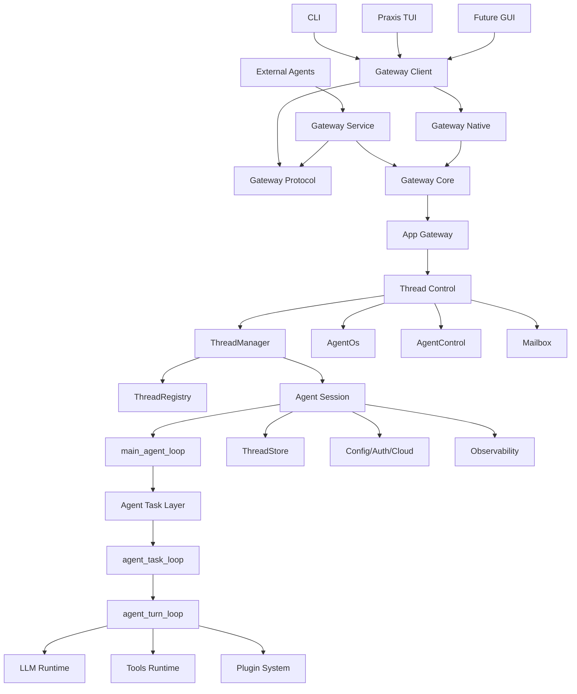

# Praxis Cleanroom Target Architecture

Date: 2026-06-14

This document records the target architecture for the Praxis cleanroom refactor. It is not a compatibility plan for making Praxis look different from Codex. It is the ownership model used to decide where every piece of Praxis code belongs, which code should be kept, which code should be absorbed from upstream, and which code should be replaced.

## 1. Positioning

Praxis is not a Codex skin and not just a CLI agent.

Praxis is:

```text
general agent backend kernel
  + multi-thread agent control system
  + plugin capability platform
  + multi-provider / multi-wire LLM layer
  + TUI / GUI / external-agent control plane
```

Core identity:

| Name | Praxis role |
|---|---|
| Praxis | General agent runtime identity. |
| Codex | Compatibility source, login source, thread import source, and upstream design reference. |
| OpenAI / GPT | Provider, auth, and model family. |
| Claude | Provider, wire, and external migration source. |
| Cursor | External session migration source. |
| Cunning3D | Product profile, plugin bundle, domain prompt, and tool policy. |

Praxis Core is organized around:

```text
Agent / Thread / Session / Task / Turn / Tool / Provider / Wire / Plugin / Product / Gateway / Store
```

## 2. Target Flow

The target control flow is:

```text
Interface Surfaces
  -> App Gateway
  -> Thread Control
  -> Agent Session
  -> main_agent_loop
  -> Agent Task
  -> agent_task_loop
  -> agent_turn_loop
  -> LLM Runtime / Tools Runtime / Plugin System / ThreadStore
```

The three explicit loop concepts are:

| Loop | Level | Responsibility |
|---|---|---|
| `main_agent_loop` | Session level | Long-lived submission/op loop. Receives `Submission`, dispatches `Op`, owns session loop lifetime. |
| `agent_task_loop` | Task level | Repeated turn control inside one task. Handles pending input, empty-model recovery, and continue/stop decisions. |
| `agent_turn_loop` | Turn level | One model/tool loop. Samples the model, streams output, executes tool calls, records turn results. |

`AgentOs` and App Gateway are not loops. `Agent Task` is a task category and handler layer; `agent_task_loop` is the real middle loop.

Pi Agent is useful as a reference for thin loop structure: the agent loop should read as control flow, not as a container for provider, storage, UI, and tool implementation details. Codex is useful as a reference for mature sandbox, exec, thread, and config implementation details. Praxis should absorb strong designs without inheriting upstream identity or accidental coupling.

## 3. Architecture Diagram



## 4. Ownership Boundaries

| Layer | Owns | Must not own |
|---|---|---|
| Interface Surfaces | User interaction, rendering, input, focus, commands. | Provider choice, rollout parsing, thread import logic, session internals. |
| App Gateway | Control protocol, request dispatch, native/service transport boundaries. | Agent decisions, thread lifecycle policy, tool execution. |
| Thread Control | Thread lifecycle, lookup, spawn, resume, fork, close, cross-thread coordination. | Per-turn model/tool execution. |
| Agent Session | Per-thread state, services, history view, event sink, active task/turn. | UI, gateway transport, marketplace sync. |
| `main_agent_loop` | Submission receive loop and op dispatch. | Provider selection, tool execution, prompt building, storage formats. |
| Agent Task / `agent_task_loop` | Task category and repeated task-level turn control. | Thread spawning, raw provider requests, UI behavior. |
| `agent_turn_loop` | One model/tool turn and turn-local state transitions. | Thread lifecycle, gateway requests, marketplace, external migration. |
| LLM Runtime | Provider, wire, behavior profile, product profile, model catalog. | TUI behavior, thread storage, tool execution. |
| Tools Runtime | Tool registry, routing, execution, sandbox policy, output policy. | Prompt ownership, provider policy, thread persistence. |
| Plugin System | Skills, apps, MCP, hooks, product profiles, prompt/tool/task overlays. | Core lifecycle, hardcoded product behavior. |
| ThreadStore | List/read/write/resume/fork/import/lazy replay/redaction/metadata/search. | TUI rendering, provider behavior, external raw parsing outside migration. |

## 5. Dependency Rules

Allowed direction:

```text
UI/TUI/CLI
  -> app-gateway-client/protocol

app-gateway
  -> app-gateway-core/protocol
  -> praxis-core service APIs

praxis-core
  -> protocol/config/plugin/tools/rollout/state/login abstractions

provider/tool/plugin implementations
  -> their own infrastructure
```

Forbidden direction:

```text
core -> tui
session -> cursor db
agent_turn_loop -> marketplace sync
main_agent_loop -> provider-specific request body
TUI -> rollout parser
Cunning3D plugin -> generic Praxis core
```

## 6. Target Modules

### App Gateway

```text
app-gateway-protocol
app-gateway-core
app-gateway-native
app-gateway-service
app-gateway-client
app-gateway
```

Praxis TUI/GUI use the native gateway by default. External agents use the service gateway through stdio, websocket, named pipe, or unix socket. TCP/WebSocket is an external control capability, not the default path for Praxis controlling itself.

### Thread Control

```text
ThreadManager
ThreadRegistry
AgentOs
AgentControl
AgentStatus
Mailbox
```

`ThreadManager` owns spawn/load/close/lookup/fork/resume. `ThreadRegistry` is only a loaded-thread registry. `AgentOs` is a coordination plane for multi-thread/multi-agent control, rank, lease, task, artifact, and runtime command concerns.

### Agent Session

```text
PraxisThread
Praxis
Session
SessionState
SessionServices
TurnContext
SessionConfiguration
```

Session is a deep module. Its public surface is submit op, receive event, status, and shutdown. It hides state, history, active turn, event sink, model config, and tool config.

### LLM Runtime

```text
llm/
  ids.rs
  wire/
  profiles/
  products/
  prompts/
  tasks/
  runtime.rs
model_provider_info.rs
provider_decision_center.rs
provider_auth.rs
models_manager/
```

Hard rule:

```text
Wire != Provider
Provider != Behavior
Behavior != Product
Product != Plugin
```

Example:

```text
OpenRouter Claude model:
  provider = openrouter
  wire = openai_compat
  behavior = claude/openrouter policy
  product = praxis or cunning3d
```

### Tools Runtime

```text
tools/
  registry.rs
  router.rs
  context.rs
  tool_call_runtime.rs
  loop_guard.rs
  output_policy.rs
  output_reducer.rs
  sandboxing.rs
  network_approval.rs
  runtimes/
  handlers/
```

`agent_turn_loop` calls `ToolRouter` and `ToolCallRuntime`. Shell, apply_patch, MCP, permission requests, user input, and multi-agent tools stay behind the tools boundary.

### Plugin / Product

Plugins can provide:

```text
skills
MCP servers
apps
hooks
LLM behavior extensions
product profiles
prompt overlays
tool policies
task policies
model catalogs
marketplace metadata
```

Cunning3D is a product/plugin/profile bundle from the perspective of Praxis. It must not be hardcoded into generic core.

### Config / Auth / Cloud

Target:

```text
praxis-config/
  loader/
  cloud_bundle/
  requirements_layers/
  thread_config/
  profile/
  diagnostics/
```

Provider abstraction:

```rust
trait ConfigBundleProvider {
    async fn load_bundle(&self, account, home) -> Result<Option<ConfigBundle>>;
}
```

Implementations:

```text
NoopConfigBundleProvider
OpenAiCodexConfigBundleProvider
CunningOrgConfigBundleProvider
LocalFileConfigBundleProvider
```

API keys are not cloud bundle login. OpenAI/Codex login compatibility remains a compatibility provider, not the identity of Praxis config.

### ThreadStore

Target:

```text
thread-store/
  store.rs
  local.rs
  live_thread.rs
  list_threads.rs
  read_thread.rs
  fork_thread.rs
  resume_thread.rs
  metadata.rs
  search.rs
  import_ledger.rs
```

ThreadStore owns list, read, resume, fork, write, metadata, lazy replay, redaction, and import ledger. Resume and fork logic must not be split across TUI, Gateway, rollout, and external migration.

### External Agent Migration

Target:

```text
external_agent_migration/
  config/
  sessions/
    codex/
    cursor/
    claude/
  ledger/
  convert/
  detect/
  import/
```

External migration is an anti-corruption layer:

```text
Cursor DB / Claude JSON / Codex rollout
  -> external_agent_migration
  -> Praxis ThreadStore / Transcript / InitialHistory
```

External raw formats must not leak into session, core, or TUI.

### TUI Workspace

Target:

```text
tui/
  shell/
  workspace/
    state.rs
    reducer.rs
    command.rs
    effects.rs
    render.rs
  panes/
    chat/
    session_picker/
    agent_picker/
    worker_board/
  transcript/
    model.rs
    virtual_list.rs
    resume_redaction.rs
  gateway/
    native_client.rs
    event_mapper.rs
```

The global workspace state machine owns pane, focus, overlay, and thread selection. Local pickers own query, source, page, selection, and action.

Default UX:

```text
Praxis opens ready to chat.
/resume /codex /cursor render in the middle pane.
Esc returns to chat.
Selecting a session resumes/forks and returns to chat.
```

### Observability

Target:

```text
otel/
analytics/
feedback/
tracing constants
diagnostics/
crash diagnostics
runtime diagnostics
performance timing
```

Metrics, spans, diagnostics, and error fields should be centrally named. New internal code should not add `codex.*` fields unless it is explicitly a compatibility alias.

## 7. Transcript and Resume Policy

Unified transcript ownership:

| Layer | Responsibility |
|---|---|
| Core | Emit canonical agent events. |
| App Gateway | Project events into protocol notifications. |
| ThreadStore | Persist and hydrate transcript records. |
| Transcript policy | Fold or redact resumed history. |
| TUI | Render transcript view models. |

Long resumed sessions should be lightweight by default:

```text
37 tool events hidden from resumed history
```

Default policy:

- Show assistant messages and thinking.
- Fold noisy tool/user/system history behind summary rows.
- Use lazy replay and virtual list rendering.
- Do not fully render long historical tool output during resume.

## 8. Naming Rules

Core language:

```text
Agent
Thread
Session
Task
Turn
Loop
Provider
Wire
BehaviorProfile
ProductProfile
Plugin
Capability
Gateway
Store
Migration
```

Brand names:

| Name | Allowed scope |
|---|---|
| Codex | Compatibility, auth, import source, behavior profile. |
| OpenAI | Provider, auth, marketplace compatibility. |
| Claude | Provider, wire, migration source. |
| Cursor | Migration source. |
| Cunning3D | Product profile, plugin, domain integration. |
| Praxis | Runtime, core, product identity. |

If a type is not specifically about Codex compatibility, it should not be named Codex.

## 9. Brooks-Based Refactor Discipline

Before moving code, diagnose the structural risk:

| Brooks risk | Praxis refactor question |
|---|---|
| Dependency Disorder | Does the dependency arrow point through the target architecture? |
| Domain Model Distortion | Does the name match Praxis domain language? |
| Knowledge Duplication | Is the same decision encoded in TUI, Gateway, Core, and storage? |
| Accidental Complexity | Is this abstraction deep enough, or is it a middleman? |
| Change Propagation | Would changing this feature touch unrelated modules? |
| Cognitive Overload | Can a new contributor state the module responsibility in one sentence? |

Every refactor finding should be expressible as:

```text
Symptom -> Source -> Consequence -> Remedy
```

Do not suggest a move just because a file is large. Move code when ownership, dependency direction, duplicated decision-making, or domain language is wrong.

## 10. Current Cleanroom Battles

| # | Battle | Goal |
|---:|---|---|
| 1 | Main Agent Loop slimming | Make the session loop readable in 30 seconds. |
| 2 | Agent Turn Loop clarification | Keep one turn of model/tool execution explicit. |
| 3 | Agent Task Layer | Separate regular, review, compact, undo, snapshot, and shell tasks. |
| 4 | Agent Session boundary | Centralize state, services, history, and event sink. |
| 5 | ThreadManager / ThreadRegistry | Keep spawn, load, lookup, close, fork, and resume ownership clear. |
| 6 | AgentOS control plane | Keep cross-thread coordination outside the three loops. |
| 7 | App Gateway consolidation | Native first for Praxis, service gateway for external agents. |
| 8 | Native Center / Workspace | Avoid remote socket control for Praxis's own UI. |
| 9 | ThreadStore | Own list, resume, fork, import, lazy replay, and metadata. |
| 10 | Event / Transcript Model | Unify event, history, and display models. |
| 11 | Resume History Policy | Fold historical tool/user/system noise. |
| 12 | TUI Workspace State Machine | Move panes, focus, and picker routing into a clear state model. |
| 13 | TUI Transcript Virtualization | Make long chat scrolling fast. |
| 14 | TUI Composer / Input Stack | Unify slash command, picker, Esc, and input behavior. |
| 15 | Provider / Wire / Product | Prevent mixed model, protocol, and product policies. |
| 16 | Config Bundle | Merge cloud config, requirements, profile, and diagnostics. |
| 17 | Plugin / Product | Treat Cunning3D and marketplaces as plugin/product layers. |
| 18 | Tool Runtime | Centralize tool registry, router, runtime, sandbox, and output policy. |
| 19 | Sandbox / Exec | Absorb strong upstream ideas behind Praxis boundaries. |
| 20 | Context / Memory Engine | Centralize context, memory, compaction, and history preview. |
| 21 | External Migration | Keep Codex/Cursor/Claude import behind anti-corruption layers. |
| 22 | Agent Identity / Role / Capability | Unify registry, role, resolver, status, mailbox, and capability language. |
| 23 | Protocol / API Governance | Control protocol growth, legacy names, and thread history schemas. |
| 24 | Core Facade / Observability / Brand | Slim public exports, diagnostics, metrics, and brand residue. |

## 11. Coverage Conclusion

These 24 battles cover the Praxis runtime architecture. Items that appear outside them should be folded back into one of these boundaries:

| Existing concern | Target boundary |
|---|---|
| cloud tasks / background jobs | Config/Auth/Cloud or Observability. |
| model registry / generated models | LLM Runtime / Model Catalog. |
| skills / core-skills | Plugin System. |
| MCP / apps / hooks | Plugin System + Tools Runtime. |
| Cunning3D prompt/tools | ProductProfile + Plugin bundle. |
| future GUI | Interface Surfaces + native App Gateway. |
| gateway processors | App Gateway + Protocol Governance. |
| state crate memories/jobs | ThreadStore + Context/Memory Engine. |
| crash logs / perf timing | Observability / Diagnostics. |
| legacy conversation names | Protocol/API Governance. |
| `CodexErrorInfo` / `CodexOp` / `CODEX_HOME` | Brand cleanup, with compatibility exceptions. |
| release/build/dev tooling | Engineering tooling, not core runtime architecture. |

If code cannot fit any target boundary, treat it as one of:

- zombie code,
- wrongly named code,
- wrongly placed product code,
- compatibility logic that needs an anti-corruption boundary,
- dev tooling that should not be in the runtime architecture.

## 12. Final Architecture Statement

```text
Praxis Core owns agent threads and turns.
App Gateway owns control.
ThreadManager owns loaded thread lifecycle.
AgentOs owns cross-thread coordination.
AgentSession owns per-thread state.
main_agent_loop owns op dispatch.
AgentTask owns task category.
agent_task_loop owns task-level repetition.
agent_turn_loop owns one model/tool turn.
LLM Runtime owns provider/wire/behavior/product policy.
Tools Runtime owns tool execution.
Plugin System owns external capability injection.
ThreadStore owns persistence, resume, fork, import, and lazy replay.
TUI/GUI own interaction only.
```
